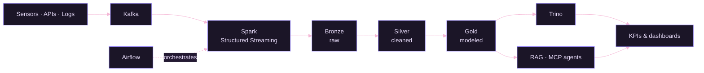

<div align="center">


</div>

```yaml
name:     Kawthar Khayet
role:     Data Engineering & AI student — INPT, Rabat
year:     3rd of 5
building:
  - streaming pipelines that don't silently drop events
  - lakehouses that are still queryable at 3am
  - LLM agents that ask before they touch production
seeking:  final-year internship (PFE) — data platforms, streaming, applied AI
```

I work on the part of the stack that sits **between the raw data and the model**: getting events in reliably, shaping them into something trustworthy, and exposing them to whatever needs to read them — a dashboard, a query engine, or an agent.

Two internships so far: an autonomous IT-operations copilot at **DXC Technology**, and an adaptive learning agent at **AI-Crafters**. On my own time, a streaming lakehouse for industrial telemetry and a statistical workbench for A/B testing.

<br>

## The pipeline I keep building



Every layer of that diagram maps to something I've actually shipped — the CNC lakehouse covers Kafka through Trino, OpsCopilot covers the agent branch.

<br>

## Stack, by layer

| Layer | What I reach for |
|:--|:--|
| **Ingest** | Kafka · REST APIs · custom scrapers |
| **Process** | Spark Structured Streaming · Python · Scala |
| **Store** | Apache Iceberg on MinIO · PostgreSQL · MongoDB |
| **Query** | Trino |
| **Orchestrate** | Airflow · Docker · GitHub Actions |
| **Model** | PyTorch · TensorFlow · scikit-learn · Transformers |
| **Explain** | SHAP · LIME · statsmodels · SciPy |
| **LLM systems** | Model Context Protocol · RAG · ChromaDB · Hugging Face |
| **Serve** | FastAPI · Streamlit · React / TypeScript |

<br>

## Selected work

<details>
<summary><b>OpsCopilot AI</b> — an AI copilot for IT operations &nbsp;·&nbsp; <code>MCP</code> <code>RAG</code> <code>FastAPI</code></summary>

<br>

Built at DXC Technology. Detects incidents on its own, diagnoses them against the actual machine over SSH rather than guessing, and retrieves the relevant runbook through RAG before proposing a fix.

Ten MCP tools, tiered by risk. Nothing executes without an engineer approving it — the human-in-the-loop isn't a setting, it's the architecture.

`Python` `FastAPI` `PostgreSQL` `ChromaDB` `MCP` `React` `TypeScript`

→ [Repository](https://github.com/kawthar-khayet/Opscopilot_AI)

</details>

<details>
<summary><b>CNC Lakehouse</b> — real-time data platform for Industry 4.0 &nbsp;·&nbsp; <code>Kafka</code> <code>Iceberg</code> <code>Trino</code></summary>

<br>

Telemetry from 10 CNC machines at one reading per second, streamed through Kafka into a Bronze / Silver / Gold medallion architecture on Iceberg + MinIO.

Industrial KPIs — OEE, MTBF, MTTR — are computed in the Gold layer and exposed through Trino, so the shop floor queries the same tables the pipeline writes.

`Kafka` `Spark Structured Streaming` `Apache Iceberg` `MinIO` `Trino` `Airflow` `Docker`

→ [Repository](https://github.com/kawthar-khayet/cnc_lakehouse)

</details>

<details>
<summary><b>AB Analysis</b> — statistical experimentation platform &nbsp;·&nbsp; <code>SciPy</code> <code>Statsmodels</code> <code>React</code></summary>

<br>

The full A/B test lifecycle in one place: import, data-quality diagnostics, automatic method selection, and an exportable report.

Seven tests implemented — z-test, Fisher, Student, Welch, Mann-Whitney, permutation, bootstrap — with the platform choosing the right one instead of leaving it to the user.

`Python` `NumPy` `SciPy` `Statsmodels` `FastAPI` `React` `TypeScript`

→ [Repository](https://github.com/kawthar-khayet/AB_analysis)

</details>

<details>
<summary><b>Speech Emotion Recognition</b> — deep learning on audio &nbsp;·&nbsp; <code>Wav2Vec2</code> <code>PyTorch</code></summary>

<br>

Seven-emotion classification across ~12,000 audio files from four datasets. Compared a CNN-LSTM baseline against a fine-tuned Wav2Vec2.

Accuracy went from 54% on the baseline to **84.9%**, with a 0.86 macro-F1.

`PyTorch` `TensorFlow` `Transformers` `Wav2Vec2` `MLflow`

→ [Repository](https://github.com/kawthar-khayet/Speech-Emotion-Recognition-using-Deep-Learning)

</details>

<details>
<summary><b>Heart Disease Prediction with XAI</b> — explainable medical AI &nbsp;·&nbsp; <code>XGBoost</code> <code>SHAP</code></summary>

<br>

Several models compared, then opened up with global and local explainability so a clinical prediction can be audited instead of trusted blindly.

`Python` `XGBoost` `Scikit-learn` `SHAP` `LIME`

→ [Repository](https://github.com/kawthar-khayet/HeartDisease_XAI)

</details>

<br>

## Timeline

```
2027 ──── Data Engineering degree, INPT
2026 ──── Data & AI Engineering Intern · DXC Technology        Jul – Aug
     ──── Events Cell Lead · ARTY Club, INPT                   2025 – 2026
2025 ──── AI Engineering Intern · AI-Crafters                  Jul
2024 ──── Started Data Engineering at INPT, Rabat
```

<br>

## Activity

<div align="center">


</div>

<br>

## Open to a final-year internship (PFE)

Production data platforms, streaming pipelines, agentic AI systems. If that's what your team builds, I'd like to hear from you.

<div align="center">

[](https://www.linkedin.com/in/kawthar-khayet-7a9903318/)
&nbsp;
[](mailto:khayetkaouthar@gmail.com)
&nbsp;
[](https://github.com/kawthar-khayet)

</div>
